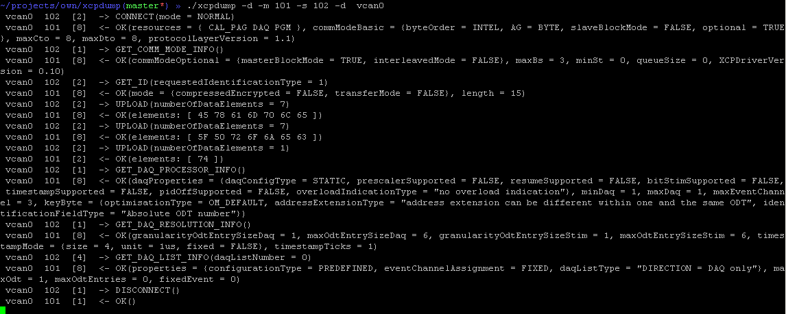

=======
xcpdump
=======

**xcpdump** is a **candump** like sniffer/tracer presenting ASAM XCP frames in a human-readable form.

note:  **xcpdump** is Linux/SocketCAN only.

How-to build
------------

Depending on your Linux distribution, you may need to install a **linux-headers** package.

On Debian based systems use

At least **zsh** users are able to auto-complete **apt-get**
.. code-block:: shell

   sudo apt-get install linux-headers-<TAB>

Then run

.. code-block:: shell

   make
   sudo make install

Usage
-----

    Usage: xcpdump [options] <CAN interface>
    Options:
             -m <can_id>  (XCP master can_id. Use 8 digits for extended IDs)
             -s <can_id>  (XCP slave can_id. Use 8 digits for extended IDs)
             -d           (include DTOs)
             -c           (color mode)
             -t <type>    (timestamp: (a)bsolute/(d)elta/(z)ero/(A)bsolute w date)

    CAN IDs and addresses are given and expected as hexadecimal values.

